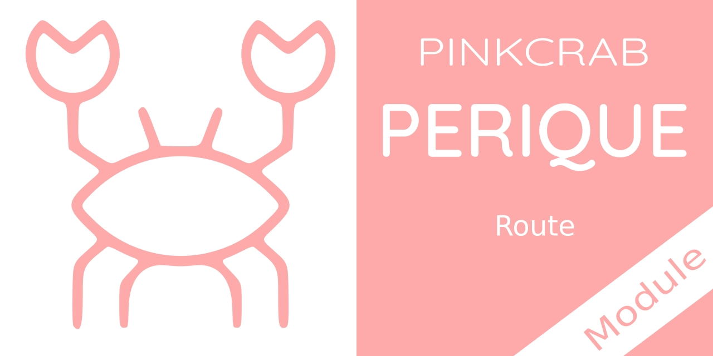

# Perique - Route

Library for registering WP Rest Routes in a more simple way.

[](https://packagist.org/packages/pinkcrab/perique-route) [](https://packagist.org/packages/pinkcrab/perique-route) [](https://packagist.org/packages/pinkcrab/perique-route) [](https://packagist.org/packages/pinkcrab/perique-route) [](https://packagist.org/packages/pinkcrab/perique-route)


[![WordPress 6.1 Test Suite [PHP7.2-8.1]](https://github.com/Pink-Crab/Perique-Route/actions/workflows/WP_6_1.yaml/badge.svg)](https://github.com/Pink-Crab/Perique-Route/actions/workflows/WP_6_1.yaml)
[![WordPress 6.0 Test Suite [PHP7.2-8.1]](https://github.com/Pink-Crab/Perique-Route/actions/workflows/WP_6_0.yaml/badge.svg)](https://github.com/Pink-Crab/Perique-Route/actions/workflows/WP_6_0.yaml)
[![WordPress 5.9 Test Suite [PHP7.2-8.1]](https://github.com/Pink-Crab/Perique-Route/actions/workflows/WP_5_9.yaml/badge.svg)](https://github.com/Pink-Crab/Perique-Route/actions/workflows/WP_5_9.yaml)
[](https://codecov.io/gh/Pink-Crab/Perique-Route)
[](https://scrutinizer-ci.com/g/Pink-Crab/Perique-Route/?branch=master)
[](https://codeclimate.com/github/Pink-Crab/Perique-Route/maintainability)


****

## Why? ##

Registering WP Rest Routes can either be extremely simple or a frustrating wit the argument array format. The Perique Route library allows for a simpler way to register single routes and groupes.

****

## Setup ##

To install, you can use composer
```bash
$ composer require pinkcrab/perique-route
```

You will need to include the Registration_Middleware to the App at boot. We have provided a static method that will handle the dependency injection.

```php
// @file: plugin.php

$app_factory->module( \PinkCrab\Route\Module\Route::class );
```
One you have the Route Middleware added to the registration process, all classes which extend `Route_Controller` will now be processed and all routes defined will be registered.

To create a route controller, just extend `Route_Controller` and return an array of all routes and groups. The controllers are constructed with the DI Container, so all dependencies can be passed. 

```php

class Some_Route extends Route_Controller {

    // @required
    protected $namespace = 'acme/v1';

    // @optional, access to constructor, so allows for full DI.
    protected $some_service;
    protected function __construct(Service $service){
        $this->some_service = $service;
    }

    // @required
    protected function define_routes( Route_Factory $factory): array {
        return [
            // Factory allows for get,post,delete,patch,put requests.
            $factory->get('/users', [$this->some_service, 'list_users' ]),
            $factory->post('/users', [$this->some_service, 'new_user' ]),
            
            // Create your groups using the group builder.
            $factory->group_builder('/users/{id}', function( Route_Group $group) : Route_Group {
                // Define the GET method.
                $group->get([$this->some_service, 'show_user'])
                    ->argument( // Define the argument proprties as per WP API
                        Integer_Type::on('id')
                            ->validate('is_numeric')
                            ->sanitization('absint')
                            ->required()
                    );

                // Define the DELETE method.
                $group->delete([$this->some_service, 'delete_user'])
                    ->authentication('some_extra_check_for_delete');

                // Define group wide authentication (applied to both routes).
                $group->authentication([$this->some_service, 'check_api_key_in_header']);

                return $group;
            })
        ];
    }

}
```

Once you have your Route_Controller setup, its just a case of passing the class to the `registration` array and it will be loaded along with Perique.

```php
//file: config/registration.php
return [
    ...other classes
    Some_Route::class,
];
```

# Routes

Each route must be defined as part of a `Route Model`, these can either be created by hand or using the supplied `Route_Factory` (which is how the `Route_Controller` operates.)

## Route Model

A route model has 4 properties which must be defined, `$method`, `$route`, `$callback` & `$namespace`. Route and Method are passed via the constructor, but namespace must be set manually. 

As per WP Api standards, all arguments in the route must be defined, this is all handled via the `Arguments` object and is explained in more detail below.

> All properties are defined as `protected` and should be handled via the supplied methods

```php 
$route = new Route('POST', 'route/path');
$route->namespace('the-thing/v1');
$route->callback(function( WP_REST_Request $request ) {
    // Do the things
});
```

It is also possible to define an `authentication` callback too

```php
$route->authentication(function(WP_REST_Request $request): bool{
    return something_check($request);
});
```

### 

[Route Docs](docs/route.md)
* [Route::namespace()](docs/route.md#namespace)
* [Route::authentication()](docs/route.md#authentication)
* [Route::callback()](docs/route.md#callback)
* [Route::argument()](docs/route.md#argument)
* [Route::with_method()](docs/route.md#with_method)


## Route_Group

Like single Route Models, the Route_Group allows for a similar process of creating related routes that share a common endpoint route and also some functionality. Also like Routes, its better to use the supplied Route_Factory, but the details here will express how to create a `Route_Group` manually (the core methods are used the same regardless).

```php
$group = new Route_Group('my_endpoints/v2','route/');
$group->authentication('shared_group_auth')
$group->get('some_callable')
    ->authentication('additional_auth_for_get_only');
$group->post('some_other_callable');
```
> This would then create a group where all routes assigned are created with the above namespace and route.

[Read Group Docs](docs/group.md)

*Setters*
* [Route_Group::post()](docs/group.md#post-http-method)
* [Route_Group::get()](docs/group.md#get-http-method)
* [Route_Group::patch()](docs/group.md#patch-http-method)
* [Route_Group::put()](docs/group.md#put-http-method)
* [Route_Group::delete()](docs/group.md#delete-http-method)
* [Route_Group::authentication()](docs/group.md#authentication)
* [Route_Group::argument()](docs/group.md#argument)

## Route_Factory

As most of the time you will be creating endpoints with a fixed namespace, there is a factory that can be used to populate this for every route it creates, while giving a clean, fluent API that can be used to create routes inline as part of arrays and return values.

```php
$factory = new Route_Factory('my_endpoints/v2');
$get = $factory->get('/endpoint', 'some_callable');
$post = $factory->get('/endpoint_2', 'some_other_callable');
```
Both of the above endpoints will be created with the `my_endpoints/v2` namespace.

### Method Helpers

There are a collection of helper methods on the `Route_Factory` which make it really easy to add methods to the existing namespace.

```php
$route = $factory->get('the/route/{name}', [$this, 'some_callback_for_get']);
$route = $factory->post('the/route/{name}', [$this, 'some_callback_for_post']);
$route = $factory->put('the/route/{name}', [$this, 'some_callback_for_put']);
$route = $factory->patch('the/route/{name}', [$this, 'some_callback_for_patch']);
$route = $factory->delete('the/route/{name}', [$this, 'some_callback_for_delete']);
```
It is even possible to create a group around the same route.

```php
$group = $factory->group_builder('the/route/{name}', function(Route_Group $group){
    $group->get([$this, 'some_callback_for_get']);
    $group->post([$this, 'some_callback_for_post']);
    $group->delete([$this, 'some_callback_for_delete']);
    $group->put([$this, 'some_callback_for_put']);
    $group->path([$this, 'some_callback_for_path']);
    return $group;
});
```

## Route Controller 

The easiest way to define routes, is to extend the `Route_Controller` abstract class. This can be created with a predefined `protected ?string $namespace;` property and a method for defining the routes/group `abstract protected function define_routes( Route_Factory $factory): array`

> See the example above

## Manual Route Creation

If you do not wish to use the Route Controller above, you will need create an instance of the `Route_Manager` class and add your route or groups to the manager and the execute the manager before `rest_init` hook is called.

```php
$manager = new Route_Manager(
    new WP_Rest_Registrar(),
    new Hook_Loader()
);

// Add routes and groups
$manager->from_route(new Route(...));
$manager->from_group(new Route_Group(...));

// Dispatch
$manager->execute();
```

> When `execute()` is called, it will create the `rest_init` hooks, so there is no need to do `add_action(...)` 

## Change Log ##
* 1.0.0 Update dev testing dependencies for WP6.1, Remove Utils and replace all with FunctionConstructors and updated docs to use `construct_registration_middleware()` rather than being given a constructed instance of the Middleware.
* 0.1.2 Update dev testing dependencies for WP6.0
* 0.1.1 Bumped to version 0.2.0 of PinkCrab Collection Dependency
* 0.1.0 Inital version
